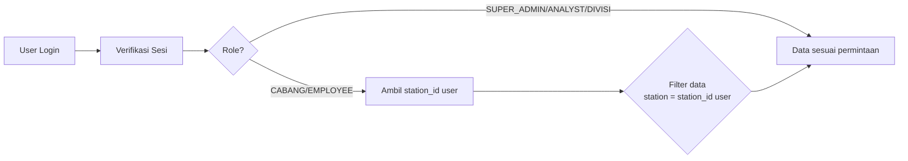
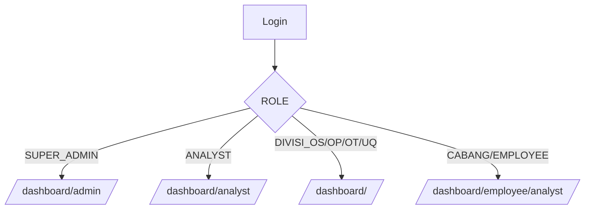

# Handbook Sistem IRRS Dashboard Gapura

Dokumen ini ditujukan untuk pembaca non-IT agar memahami sistem secara menyeluruh: apa yang dikerjakan aplikasi, bagaimana struktur proyeknya, alur data, layanan pendukung (Google Sheets & Supabase), API yang tersedia, serta cara mengoperasikan dan menyelesaikan masalah umum.


## 1. Gambaran Umum

- Fungsi utama: Mencatat, memantau, dan menganalisis laporan Irregularity/Complaint/Compliment dari seluruh cabang.
- Sumber data laporan: Google Sheets (tab utama “NON CARGO” dan “CGO”). Aplikasi membaca langsung dari Sheets.
- Otentikasi & data pendukung: Supabase (database di cloud) dipakai untuk login pengguna, data master (mis. daftar station/cabang), dan data pelengkap laporan.
- Peran (role) utama:
  - SUPER_ADMIN: akses penuh.
  - ANALYST: melihat analitik menyeluruh.
  - DIVISI_…/PARTNER_…: dashboard per-divisi (OS/OT/OP/UQ/…).
  - CABANG/EMPLOYEE: hanya melihat laporan dari station (cabang) sendiri.


## 2. Arsitektur Tingkat Tinggi

- Frontend & API: Next.js (App Router). Halaman dashboard dan endpoint API berada dalam satu proyek.
- Data pipeline:
  1) Frontend (dashboard) memanggil endpoint internal (mis. `/api/admin/reports` dan `/api/admin/analytics`).
  2) Endpoint akan mengambil data dari Google Sheets (laporan) dan Supabase (pengguna, station, dll).
  3) Hasil diproses, difilter sesuai peran pengguna (RBAC), lalu dikirim ke UI.
- Penyegaran data:
  - Cache laporan bisa dibersihkan via endpoint khusus untuk memaksa baca ulang dari Sheets.

### Diagram Arsitektur (Sederhana)

```mermaid
flowchart LR
    A[Pengguna\n(SUPER_ADMIN / ANALYST / CABANG)] --> B[Next.js UI]
    B --> C[/api/admin/reports\n/api/admin/analytics\n/api/auth/me/]
    C -->|Baca laporan| D[Google Sheets\nNON CARGO + CGO]
    C -->|Auth & Master Data| E[Supabase\nusers, stations, reports]
    C -->|RBAC| F{Filter sesuai\nrole & station user}
    F --> B
```

Jika diagram tidak tampil, bayangkan alurnya:
- Pengguna → Antarmuka → Endpoint API → (Baca laporan dari Sheets + Data pendukung dari Supabase) → RBAC → Kembali ke UI.


## 3. Struktur Proyek (Ringkas)

- `app/` — Halaman (dashboard) dan endpoint API.
  - `app/dashboard/...` — Semua halaman dashboard (analyst, divisi, cabang).
  - `app/api/...` — Endpoint API untuk laporan, analitik, autentikasi, dsb.
- `components/` — Kumpulan komponen UI (tabel, grafik, layout).
- `lib/` — Utilitas dan layanan:
  - `lib/services/reports-service.ts` — Mesin utama baca laporan dari Google Sheets, gabung dengan Supabase, dan menyajikan data siap pakai.
  - `lib/supabase.ts` & `lib/supabase-admin.ts` — Koneksi ke Supabase (user-level & admin).
  - `lib/google-sheets.ts` — Koneksi ke Google Sheets API.
  - `lib/auth-utils.ts` — Verifikasi sesi login.
- `scripts/` — Skrip bantu debugging & diagnosa Google Sheets.
- `types/` — Tipe TypeScript untuk konsistensi data.


## 4. Alur Data Laporan

1) Sumber Google Sheets
   - Kolom-kolom seperti “Date of Event”, “Report Category”, “Area”, “Branch/Reporting Branch/Station Code”, dll.
   - Sistem mengonversi baris di Sheets menjadi objek laporan dengan field standar.

2) Normalisasi & Identitas Stabil
   - Setiap baris diberi “ID kanonik” berbasis UUID v5 dari “sheet_name!row_X”. Ini membuat referensi laporan konsisten walau baris bergeser.

3) Penggabungan dengan Supabase
   - Laporan dari Sheets diperkaya data dari tabel Supabase (jika ada catatan yang cocok), mis. `user_id`, timestamp, dll.

4) Penyajian ke UI
   - Endpoint `/api/admin/reports` mengembalikan daftar laporan (dapat difilter).
   - Endpoint `/api/admin/analytics` mengembalikan ringkasan/statistik (per station, per status, tren bulanan, dsb).

### Diagram Pipeline Laporan

```mermaid
flowchart TD
    S1[Google Sheets\nTab NON CARGO & CGO] --> P1[mapRowToReport\nNormalisasi kolom]
    P1 --> P2[Set ID kanonik (UUID v5)]
    P2 --> P3[Set station_id/station_code dari Branch]
    P3 --> M1[Gabung dengan data Supabase\n(user_id, dsb)]
    M1 --> F1{Filter opsi pengguna\n(status, rentang tanggal, dsb)}
    F1 --> R1[Hasil akhir ke UI\n(tabel & grafik)]
```


## 5. Pembatasan Akses (RBAC)

- User CABANG/EMPLOYEE hanya melihat data dari station miliknya.
- Pembatasan dilakukan di server (API), bukan hanya di tampilan.
- Ketika user cabang memanggil `/api/admin/reports` atau `/api/admin/analytics`, server otomatis memfilter menjadi hanya station user tersebut.

### Diagram RBAC (Sederhana)




## 6. Komponen Penting di Kode

- Layanan laporan: `lib/services/reports-service.ts`
  - Membaca kumpulan sheet (“NON CARGO” dan “CGO”). 
  - Mengubah setiap baris menjadi objek laporan (fungsi `mapRowToReport`), termasuk normalisasi kategori/status/severity, dan pemetaan `branch → station_id/station_code`.
  - Menggabungkan data dari Supabase bila ada.
  - Menyediakan caching dan fungsi invalidasi cache.

- Halaman dashboard Analyst Cabang: `app/dashboard/(main)/employee/analyst/page.tsx`
  - Menampilkan tabel dan grafik, tetapi data otomatis dibatasi RBAC.

- Middleware/Proxy: `proxy.ts`
  - Mengarahkan user ke dashboard sesuai peran (contoh: CABANG → `/dashboard/employee/analyst`).
  - Melindungi route agar user tanpa sesi diarahkan ke halaman login.

- Endpoint kunci:
  - `/api/admin/reports` — daftar laporan; filter: status, station, target_division, rentang tanggal, dan pencarian kata kunci.
  - `/api/admin/analytics` — ringkasan statistik (jumlah per station/status/tren).
  - `/api/auth/me` — informasi user yang sedang login (termasuk station).
  - `/api/reports/refresh` — invalidasi cache pembacaan Sheets.

### Diagram Rute & Role




## 7. Metode & “Algoritma” yang Relevan

- ID Kanonik untuk baris Google Sheets
  - Sistem membuat UUID v5 dari string “<Sheet>!row_<nomor>”. Ini memastikan komentar/relasi ke laporan tetap stabil.

- Pemetaan Station/Branch
  - Bila kolom “Branch/Reporting Branch/Station Code” terisi, maka `station_id` dan `station_code` disamakan dengan kode itu (contoh: `DPS`), sehingga konsisten untuk filter.

- Penggabungan Sumber (Sheets + Supabase)
  - Data utama selalu bersumber dari Google Sheets.
  - Catatan yang hanya ada di Supabase (contoh: laporan yang dibuat via aplikasi) ikut digabung.

- Caching & Invalidasi
  - Data laporan disimpan sementara untuk mempercepat halaman.
  - Tombol/endpoint refresh menghapus cache agar aplikasi membaca ulang dari Sheets.


## 8. API (Ringkasan Non-IT)

- GET `/api/admin/reports`
  - Mengambil daftar laporan.
  - Parameter filter (opsional): 
    - `status` (mis. `CLOSED`, `OPEN`), 
    - `station` (kode cabang, mis. `DPS`), 
    - `from`/`to` (tanggal), 
    - `search` (kata kunci judul/isi), 
    - `target_division`.
  - Otomatis membatasi data sesuai peran user.

- GET `/api/admin/analytics`
  - Mengambil ringkasan statistik (jumlah laporan, distribusi status, per station, tren beberapa bulan, dsb).
  - Otomatis dibatasi peran user cabang.

- GET `/api/auth/me`
  - Informasi akun yang login, termasuk role dan station.

- POST `/api/reports/refresh`
  - Mengosongkan cache agar data diambil ulang dari Google Sheets.


## 9. Supabase (Database)

Walau sumber utama laporan dari Google Sheets, Supabase tetap dipakai untuk:

- Pengguna (`users`):
  - Kolom penting: `id`, `email`, `full_name`, `role`, `division`, `status`, `station_id`.
  - `station_id` berisi kode station (contoh: `DPS`), digunakan untuk membatasi akses data.

- Station (`stations`):
  - Daftar station, minimal memiliki `code` (mis. `CGK`, `DPS`) dan `name`.

- Laporan (`reports`) [opsional/pelengkap]:
  - Menyimpan laporan yang dibuat dari aplikasi atau sinkronisasi tertentu.
  - Diselaraskan dengan baris Sheets saat memungkinkan.

Catatan: Operasi admin (membaca langsung tabel) menggunakan client “admin”; pemakaiannya terbatas di server untuk keamanan.


## 10. Variabel Lingkungan (Environment)

- Google API:
  - `GOOGLE_SERVICE_ACCOUNT_EMAIL`
  - `GOOGLE_PRIVATE_KEY`
  - `GOOGLE_SHEET_ID` (ID spreadsheet sumber laporan)
- Supabase:
  - `NEXT_PUBLIC_SUPABASE_URL`
  - `SUPABASE_SERVICE_ROLE_KEY` (server-side)
  - `NEXT_PUBLIC_SUPABASE_ANON_KEY` (client-side)

Jaga kerahasiaan nilai variabel ini. Jangan membagikannya di luar tim yang berwenang.


## 11. Operasional Harian (Non-IT)

- Login sesuai peran Anda.
- Jika Anda user cabang, Anda akan otomatis masuk ke dashboard “Analyst Cabang” yang hanya menampilkan data station Anda.
- Jika data tampak tidak terbaru:
  - Klik tombol refresh (bila tersedia) atau minta tim untuk memanggil `/api/reports/refresh` agar cache dibersihkan.
- Jika data cabang Anda kosong padahal ada di Sheets:
  - Pastikan akun Anda memiliki `station_id` yang benar (mis. `DPS`), bukan nama lengkap bandara.


## 12. Troubleshooting

- “Unauthorized” (401) saat akses:
  - Sesi login sudah habis atau belum login. Silakan login ulang.

- Dashboard cabang kosong:
  - Cek apakah `station_id` akun Anda sudah benar (format kode, mis. `DPS`).
  - Minta tim melakukan refresh data.
  - Verifikasi di Google Sheets bahwa kolom Branch/Reporting Branch/Station Code berisi kode yang sama (contoh `DPS`).

- Data belum terbarui setelah ubah di Sheets:
  - Cache mungkin belum dibersihkan. Jalankan refresh data.


## 13. FAQ (Pertanyaan Umum)

- Q: Kenapa memakai Google Sheets sebagai sumber laporan?
  - A: Memudahkan input dari banyak pihak dan cepat diadopsi. Aplikasi memastikan pembacaan stabil dan konsisten.

- Q: Mengapa user cabang tidak bisa melihat cabang lain?
  - A: Pembatasan akses demi keamanan dan relevansi. User hanya melihat data dari station yang menjadi tanggung jawabnya.

- Q: Apakah bisa ekspor data?
  - A: Di dashboard tersedia fitur ekspor (Excel/PDF) pada bagian tertentu.


## 14. Glosarium

- Station/Branch: Kode cabang bandara (contoh: CGK, DPS, SUB).
- RBAC: Role-Based Access Control — pembatasan data dan fitur berdasarkan peran pengguna.
- Cache: Penyimpanan sementara untuk mempercepat pemuatan data.
- UUID v5: Metode membuat ID unik yang konsisten dari teks sumber (contoh: “NON CARGO!row_123”).


---

Dokumen ini ringkas dan non-teknis. Untuk rujukan teknis lebih lanjut (untuk tim IT), lihat file kode terkait pada folder `app/`, `lib/`, dan `components/` dalam repositori.
