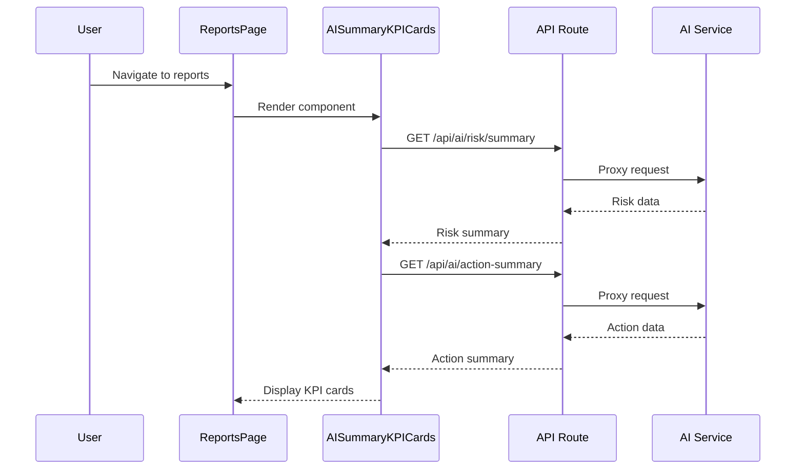

# AI Summary Integration Plan

## Overview

Integrate AI-powered summary and analysis features into the "Semua Laporan" (All Reports) pages across all divisions and enhance the Report Detail View with AI analysis capabilities.

## Endpoints to Use

### 1. Risk Summary API
- **Endpoint**: `/api/ai/risk/summary` (new proxy route)
- **Source**: Python AI service at `{AI_SERVICE_URL}/api/ai/risk/summary`
- **Purpose**: Provides risk distribution across airlines, branches, and hubs

### 2. Action Summary API
- **Endpoint**: `/api/ai/action-summary` (new proxy route)
- **Source**: `https://ridzki-nrzngr-gapura-ai.hf.space/api/ai/action-summary`
- **Purpose**: Provides action recommendations and category-wise statistics

### 3. AI Analyze API (existing)
- **Endpoint**: `/api/ai/analyze`
- **Source**: Python AI service
- **Purpose**: Single report analysis with predictions and NLP insights

---

## Architecture

```mermaid
flowchart TB
    subgraph Frontend
        RP[Reports Pages]
        RDV[ReportDetailView]
        KPI[AI Summary KPI Cards]
        AISection[AI Analysis Section]
    end

    subgraph API Routes
        RSR[/api/ai/risk/summary/route.ts]
        ASR[/api/ai/action-summary/route.ts]
        AR[/api/ai/analyze/route.ts]
    end

    subgraph External Services
        AIS[Python AI Service]
        HFS[HuggingFace Space]
    end

    RP --> KPI
    RDV --> AISection
    KPI --> RSR
    KPI --> ASR
    AISection --> AR
    RSR --> AIS
    ASR --> HFS
    AR --> AIS
```

---

## Implementation Tasks

### Task 1: Create API Routes

#### 1.1 Risk Summary Route
**File**: `app/api/ai/risk/summary/route.ts`

```typescript
// Proxy endpoint for risk summary data
// GET request to Python AI service
// Returns: airline_risks, branch_risks, hub_risks, top risky entities
```

**Response Structure** (from risk-summary.json):
```json
{
  "last_updated": "2026-03-02T00:00:00.000Z",
  "airline_risks": { "Critical": 5, "High": 12, "Medium": 20, "Low": 9 },
  "branch_risks": { "Critical": 3, "High": 9, "Medium": 18, "Low": 14 },
  "hub_risks": { "Critical": 2, "High": 7, "Medium": 15, "Low": 10 },
  "top_risky_airlines": ["GA", "SJ", "QG", "ID", "JT"],
  "top_risky_branches": ["CGK", "DPS", "SUB", "UPG", "KNO"],
  "total_airlines": 25,
  "total_branches": 35,
  "total_hubs": 7,
  "airline_details": [...],
  "branch_details": [...],
  "hub_details": [...]
}
```

#### 1.2 Action Summary Route
**File**: `app/api/ai/action-summary/route.ts`

```typescript
// Proxy endpoint for action summary data
// GET request to HuggingFace Space
// Returns: categories, overallSummary, topCategories, globalRecommendations
```

**Response Structure** (from action-summary.json):
```json
{
  "status": "success",
  "totalRecords": 1020,
  "categories": {
    "Pax Handling": {
      "count": 56,
      "severityDistribution": { "Low": 47, "Medium": 9 },
      "topActions": [...],
      "avgResolutionDays": 1.36,
      "topHubs": [...],
      "topAirlines": [...],
      "effectivenessScore": 1.0,
      "openCount": 0,
      "closedCount": 56,
      "highPriorityCount": 0
    },
    ...
  },
  "overallSummary": {
    "totalRecords": 1020,
    "openCount": 118,
    "closedCount": 902,
    "highPriorityCount": 326,
    "severityDistribution": { "Low": 614, "Medium": 80, "High": 326 },
    "avgResolutionDays": 1.85,
    "categoriesCount": 6
  },
  "topCategoriesByCount": [...],
  "topCategoriesByRisk": [...],
  "globalRecommendations": [...]
}
```

---

### Task 2: Create AI Summary KPI Cards Component

**File**: `components/dashboard/ai-summary/AISummaryKPICards.tsx`

#### Component Structure:

```tsx
interface AISummaryKPICardsProps {
  refreshInterval?: number; // Auto-refresh interval in ms
  className?: string;
}

export function AISummaryKPICards({ refreshInterval = 300000 }: AISummaryKPICardsProps) {
  // Fetch risk summary
  // Fetch action summary
  // Display KPI cards
}
```

#### KPI Cards to Display:

**From Risk Summary:**
1. **Total Critical Risks** - Sum of Critical across airline/branch/hub
2. **Total High Risks** - Sum of High across airline/branch/hub
3. **Top Risky Airline** - First item from top_risky_airlines
4. **Top Risky Branch** - First item from top_risky_branches

**From Action Summary:**
1. **Total Records** - overallSummary.totalRecords
2. **Open Cases** - overallSummary.openCount
3. **High Priority** - overallSummary.highPriorityCount
4. **Avg Resolution** - overallSummary.avgResolutionDays (in days)
5. **Effectiveness Score** - Average across categories

#### Visual Design:
- Use existing KPICard pattern from the codebase
- Glass-morphism style matching the reports page header
- Color-coded by severity (red for critical, orange for high, etc.)
- Loading skeleton states
- Error boundary with retry button

---

### Task 3: Create AI Analysis Section for Report Detail

**File**: `components/dashboard/ai-summary/AIAnalysisSection.tsx`

#### Component Structure:

```tsx
interface AIAnalysisSectionProps {
  report: Report;
  autoFetch?: boolean; // Default: true
}

export function AIAnalysisSection({ report, autoFetch = true }: AIAnalysisSectionProps) {
  // Auto-fetch AI analysis when report changes
  // Display analysis results
}
```

#### Analysis Data to Display (from api-ai-analyze.json):

1. **Predicted Resolution Time**
   - predictedDays from regression.predictions
   - confidenceInterval range
   - Feature importance breakdown

2. **Severity Classification**
   - severity from nlp.classifications
   - severityConfidence percentage
   - issueType and areaType

3. **Extracted Entities**
   - Entity list with labels (AIRLINE, FLIGHT_NUMBER, DATE, etc.)
   - Confidence scores

4. **Executive Summary**
   - executiveSummary from nlp.summaries
   - keyPoints bullet list

5. **Sentiment Analysis**
   - urgencyScore
   - sentiment label
   - keywords

6. **Trend Analysis**
   - byAirline trends
   - byHub trends
   - byCategory trends

#### Visual Design:
- Collapsible sections for each analysis type
- Color-coded severity badges
- Progress bars for confidence scores
- Entity tags with icons
- Trend indicators (up/down arrows)

---

### Task 4: Integration Points

#### 4.1 Reports Pages to Update:

| Page | File Path | Integration Point |
|------|-----------|-------------------|
| Analyst Reports | `app/dashboard/(main)/analyst/reports/page.tsx` | Header section after stats |
| Admin Reports | `app/dashboard/(main)/admin/reports/page.tsx` | Header section after stats |
| Employee Reports | `app/dashboard/(main)/employee/reports/page.tsx` | Header section after stats |
| OP Reports | `app/dashboard/(main)/op/reports/page.tsx` | Header section after stats |

#### 4.2 Report Detail View:
- **File**: `components/dashboard/ReportDetailView.tsx`
- **Integration**: Add AIAnalysisSection after the main report info, before comments section

---

## File Structure

```
app/
├── api/
│   └── ai/
│       ├── risk/
│       │   └── summary/
│       │       └── route.ts          # NEW: Risk summary proxy
│       ├── action-summary/
│       │   └── route.ts              # NEW: Action summary proxy
│       └── analyze/
│           └── route.ts              # EXISTING: Single report analysis

components/
└── dashboard/
    └── ai-summary/
        ├── AISummaryKPICards.tsx     # NEW: KPI cards component
        ├── AIAnalysisSection.tsx     # NEW: Report analysis section
        ├── RiskSummaryCard.tsx       # NEW: Individual risk card
        ├── ActionSummaryCard.tsx     # NEW: Individual action card
        └── index.ts                  # NEW: Barrel export
```

---

## Data Flow



---

## Error Handling

1. **API Unavailable**: Show cached data if available, otherwise show skeleton with retry button
2. **Timeout**: 30-second timeout for API calls, show partial data if one endpoint fails
3. **Rate Limiting**: Implement request deduplication and caching (5-minute TTL)

---

## Performance Considerations

1. **Caching**: Use React Query or SWR for data caching
2. **Lazy Loading**: Load AI summary cards after main content
3. **Debouncing**: Debounce refresh calls
4. **Parallel Requests**: Fetch risk and action summaries in parallel

---

## Testing Checklist

- [ ] API routes return correct data structure
- [ ] KPI cards display correctly on all report pages
- [ ] Loading states work properly
- [ ] Error states show retry option
- [ ] AI analysis section loads automatically on report detail
- [ ] All analysis data points are displayed correctly
- [ ] Responsive design works on mobile/tablet/desktop
- [ ] Dark mode support (if applicable)

---

## Estimated Files to Create/Modify

### New Files (7):
1. `app/api/ai/risk/summary/route.ts`
2. `app/api/ai/action-summary/route.ts`
3. `components/dashboard/ai-summary/AISummaryKPICards.tsx`
4. `components/dashboard/ai-summary/AIAnalysisSection.tsx`
5. `components/dashboard/ai-summary/RiskSummaryCard.tsx`
6. `components/dashboard/ai-summary/ActionSummaryCard.tsx`
7. `components/dashboard/ai-summary/index.ts`

### Modified Files (5):
1. `app/dashboard/(main)/analyst/reports/page.tsx`
2. `app/dashboard/(main)/admin/reports/page.tsx`
3. `app/dashboard/(main)/employee/reports/page.tsx`
4. `app/dashboard/(main)/op/reports/page.tsx`
5. `components/dashboard/ReportDetailView.tsx`

---

## Next Steps

1. Switch to Code mode to implement the API routes
2. Create the AI Summary components
3. Integrate into report pages
4. Test and verify functionality
